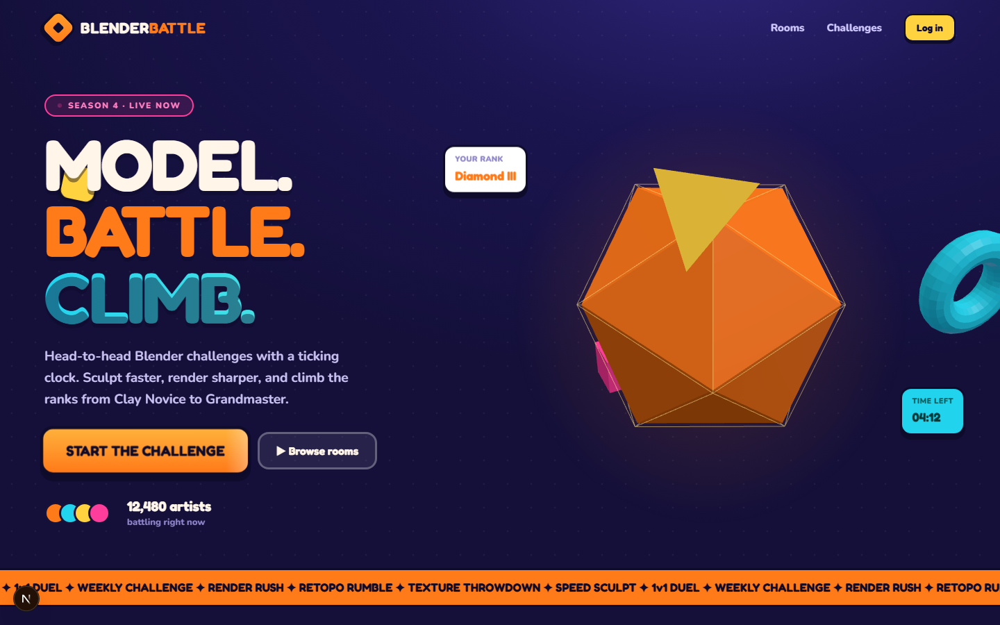
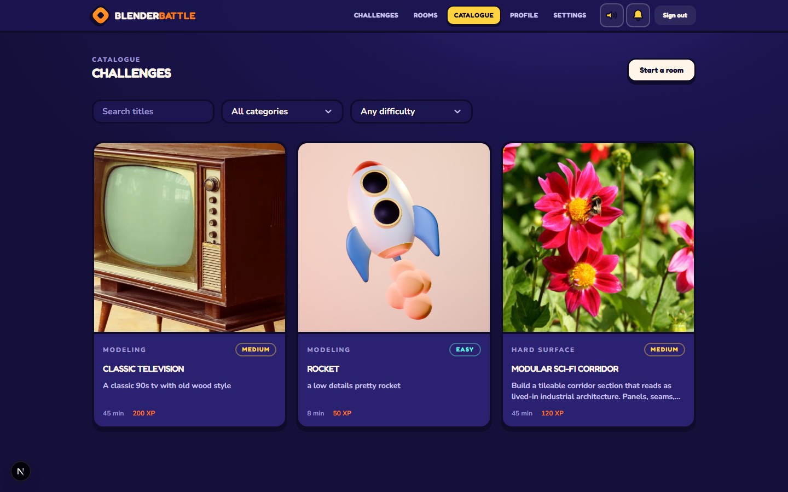
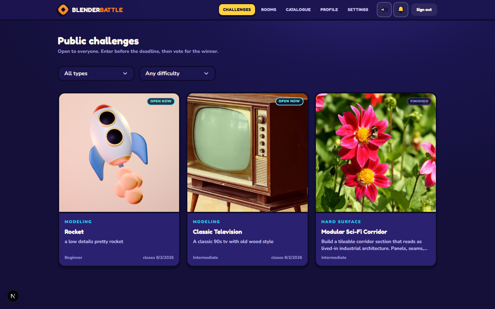
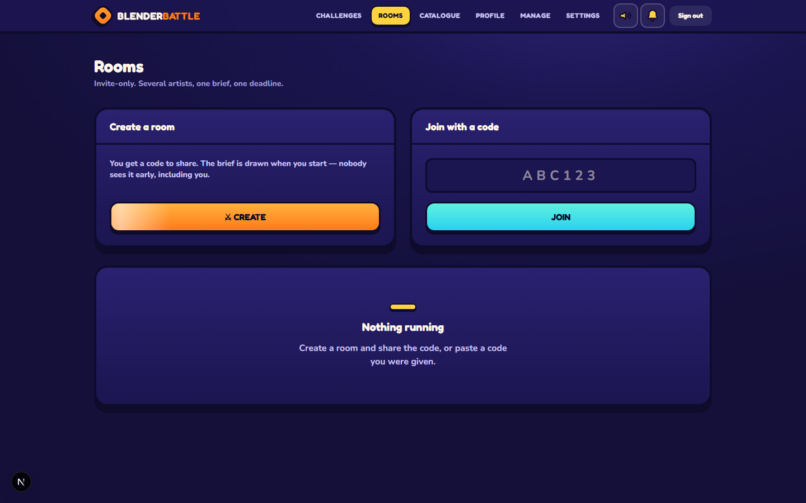
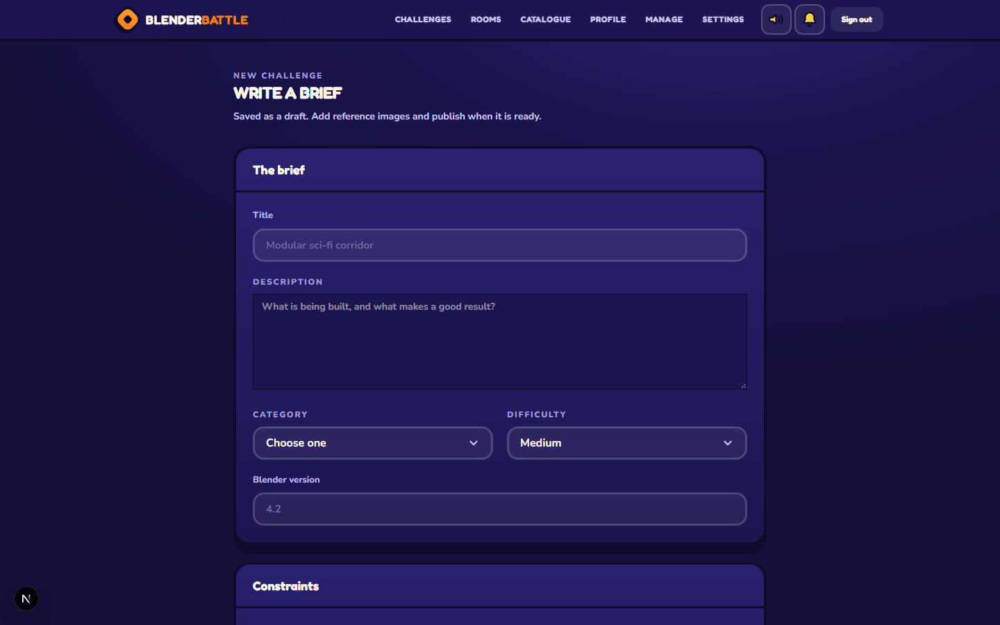
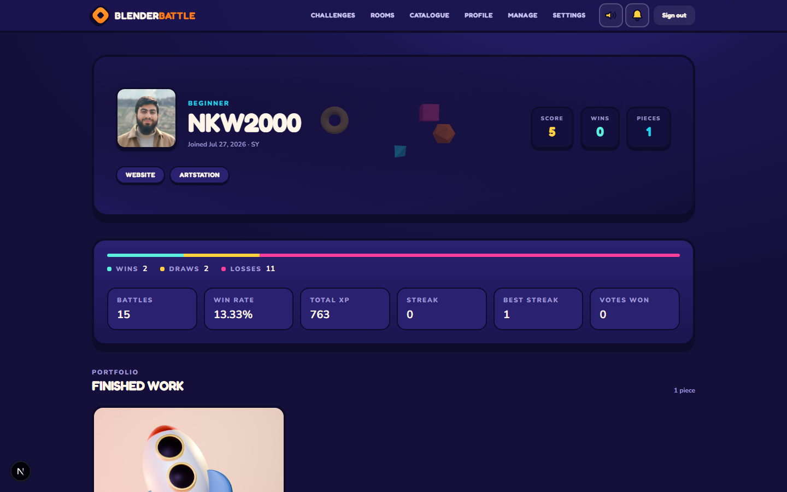

<div align="center">

# Blender Battle

**A timed 3D‑modelling contest platform for Blender artists.**

Draw a brief, model against a server‑authoritative clock, get judged by a blind ballot.

[Deployment guide](DEPLOYMENT.md) · [Report a bug](../../issues)

<br>



</div>

---

## What this is

Blender Battle runs 3D‑modelling contests in two shapes:

- **Public challenges** — anyone enters before a deadline, then the whole
  community votes for a winner. The ballot is **blind**: no author names and no
  vote counts are shown while voting is open, so nobody can pile onto the
  visible leader. Everything reveals — names, tallies, the winner — the moment
  voting closes.
- **Rooms** — small, invite‑only contests among a handful of players. A brief
  is drawn *at kickoff*, not at creation, so not even the host can see it
  early and prepare in advance. A tie at the top escalates to a single runoff
  round instead of a coin flip.

Winning entries populate an artist's **portfolio**: a profile page that pulls
the artist's own uploaded `.glb`/`.gltf`/`.fbx`/`.obj` models into a live
three.js scene behind their stats, each one auto‑scaled and recentred from
whatever raw units the file was exported in.

Every clock in the system is a timestamp fixed server‑side, never a duration a
client counts down — a background scheduler advances rooms and challenges
through their phases on its own, with a Redis lock so multiple API instances
can't double‑process the same transition.

## Features

- Challenge catalogue with categories, difficulty, and a manager‑authored brief
  (objectives, allowed/forbidden assets, reference images)
- Server‑side random draw for rooms — the host declares filters, never a
  specific challenge, so nobody can arrive already having modelled the brief
- Blind public‑challenge voting with a configurable submission window and a
  separate voting window (hours or days), auto‑resolved by a scheduler
- Room lifecycle: lobby → drawn brief → timed build → ballot → optional runoff
  → completed, with automatic host handover if the host abandons the lobby
- Placement, win/loss/draw record, streaks, and XP rolled up to the profile
  after every room — one atomic update per player, so the numbers can never
  drift out of sync with the database's own consistency check
- 3D portfolio: real uploaded models rendered and lit in the site's own visual
  language, not stand‑in shapes
- JWT auth with rotation‑and‑reuse detection, plus optional Discord/Google OAuth
- Role‑based access (player / manager / admin), audit‑logged moderation actions
- Cursor‑paginated lists throughout; no offset pagination anywhere

## Screenshots

<table>
<tr>
<td width="50%">

**Catalogue** — filter by category and difficulty, thumbnail and brief on every card



</td>
<td width="50%">

**Public challenges** — open/finished status, closes‑at countdown, blind until judged



</td>
</tr>
<tr>
<td width="50%">

**Rooms** — invite‑only, code to join, brief drawn at kickoff



</td>
<td width="50%">

**Manager brief editor** — write the objectives, category, and difficulty



</td>
</tr>
</table>

**3D portfolio** — the artist's own uploaded models, floating live behind their stats



## Tech stack

| Layer | Choice |
|---|---|
| Frontend | Next.js 15 (App Router), React 19, Tailwind CSS 4, TanStack Query, React Hook Form + Zod, three.js |
| Backend | NestJS 11, TypeORM, class-validator, Passport JWT |
| Data | PostgreSQL 16, Redis 7 |
| Storage | Cloudinary (entry images and challenge reference assets) |
| Tooling | pnpm workspaces, Docker Compose, ESLint, Vitest (unit tests for the API) |

## Architecture

A pnpm monorepo, three packages:

```
apps/
  web/       Next.js — routes, components, feature hooks
  api/       NestJS — modules, controllers, services, entities, migrations
packages/
  shared/    Enums, DTO contracts, and field limits both sides agree on
```

`packages/shared` is the vocabulary, not the validation. The web app uses Zod
for form feedback; the API uses class-validator at the request boundary and is
the only authority on what's actually accepted — the two are meant to agree,
but only one of them is trusted.

Every API response shares one envelope:

```json
{ "success": true, "message": "", "data": {} }
```

Failures add `error: { code, details?, requestId }`; clients branch on `code`,
never on message text.

<details>
<summary><b>Endpoint map</b></summary>

| Area | Endpoints |
|---|---|
| Auth | `POST /auth/register`, `/login`, `/refresh`, `/logout` · `GET /auth/me` · OAuth: `/auth/oauth/providers`, `/:provider`, `/:provider/callback`, `/exchange`, `/linked` |
| Users | `GET /users/by-username/:username` (+ `/portfolio`) · `GET/PATCH /users/me` · `POST /users/me/avatar` · admin: `GET /users`, `PATCH /:id/role`, `/:id/status` |
| Challenges | `GET /challenges`, `/categories`, `/tags`, `/:slug` · `POST /challenges/draw` · manager: create/update/publish/archive/assets |
| Public challenge events | `GET /challenge-events`, `/:id` · `POST /:id/entries`, `/:id/vote` · manager: `/schedule`, `/unschedule`, `/close` |
| Rooms | `GET /rooms/active`, `/:id` · `POST /rooms`, `/join` · `DELETE /:id/leave` · `POST /:id/submit`, `/:id/start` · `GET /:id/ballot` · `POST/DELETE /:id/ballot/:submissionId/like` |
| Analytics | `GET /admin/metrics`, `/manager/metrics`, `/admin/activity` |
| Notifications | `GET /notifications`, `/unread-count` · `POST /:id/read`, `/read-all` |
| Ops | `GET /health`, `/health/ready` (unversioned) |

</details>

## Getting started

**Prerequisites:** Node 22+, pnpm 11+ (`corepack enable`), Docker Desktop, a
[Cloudinary](https://cloudinary.com) account.

```bash
git clone https://github.com/NKW2000/blender-battle.git
cd blender-battle
cp .env.example .env
```

Fill in `.env`. The two JWT secrets must differ from each other and be at
least 32 characters:

```bash
node -e "console.log(require('crypto').randomBytes(48).toString('base64url'))"
```

Then:

```bash
pnpm install
pnpm --filter @bb/shared build
docker compose up -d postgres redis
pnpm db:migrate
pnpm dev
```

Web at `http://localhost:3000`, API at `http://localhost:4000`.

### Common commands

```bash
pnpm dev              # web + api, in parallel
pnpm build            # shared, then both apps
pnpm typecheck        # every workspace
pnpm lint             # every workspace
pnpm test             # every workspace
pnpm db:migrate       # apply pending migrations
pnpm db:revert        # roll back the last migration
pnpm infra:up         # postgres + redis only, no app processes
```

## Deployment

Both apps on **Vercel**, as two projects from this repository, with Postgres on
**Neon** and Redis on **Upstash**. Each project redeploys on push.

GitHub Actions runs [CI](.github/workflows/ci.yml) — typecheck, lint, tests,
builds — and deploys nothing.

Vercel runs a function per request, so the schedulers never fire there. Most of
the application does not care, and deliberately so: a room's phase advances when
it is read and a challenge's is derived from its dates, neither of which needs a
process watching a clock. The work that *is* not read-driven — freezing a
winner, pruning expired tokens — is triggered by cron over HTTP. Full
walkthrough, including exactly which environment variables go where:
**[DEPLOYMENT.md](DEPLOYMENT.md)**.

## Security notes

A few decisions worth knowing about before extending this:

- **Bearer tokens, not cookies.** No CSRF middleware — a cross-site request
  cannot attach an `Authorization` header, and adding cookie auth without also
  adding CSRF protection would reopen that hole.
- **Refresh rotation with reuse detection.** Presenting an already-rotated
  refresh token revokes its entire token family, not just that one token.
- **The random draw takes filters, never an id.** `POST /challenges/draw`
  resolves the challenge server-side; a client-supplied id is rejected by the
  DTO, because accepting one would let a host hand themselves a brief they'd
  already prepared for.
- **Voting is blind at the server, not hidden in the UI.** The API strips
  author identity and vote counts from every response while a ballot is open —
  a client can't be tricked into revealing what it was never sent.
- **One vote per person is a database constraint**, not an application check.
  An application check loses a race between two browser tabs; a `UNIQUE`
  constraint cannot.
- **Deadlines are absolute timestamps, computed server-side.** Clients receive
  the timestamp plus the server's own clock and compute remaining time
  themselves — a client cannot extend its own deadline.
- **Phase transitions run in a locked scheduler**, never as a per-instance
  in-process timer that would die with the process or double-fire across
  multiple instances. Every transition is also a conditional `UPDATE`, so a
  duplicate tick can't apply twice.
- **Migrations only.** `synchronize` is never enabled, in any environment —
  every schema change is a reviewed, reversible file.

## License

All rights reserved. No license is currently granted for reuse or redistribution.
